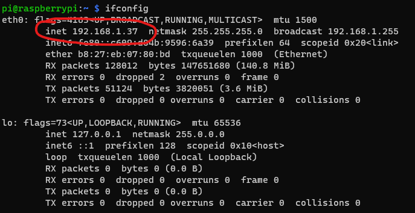
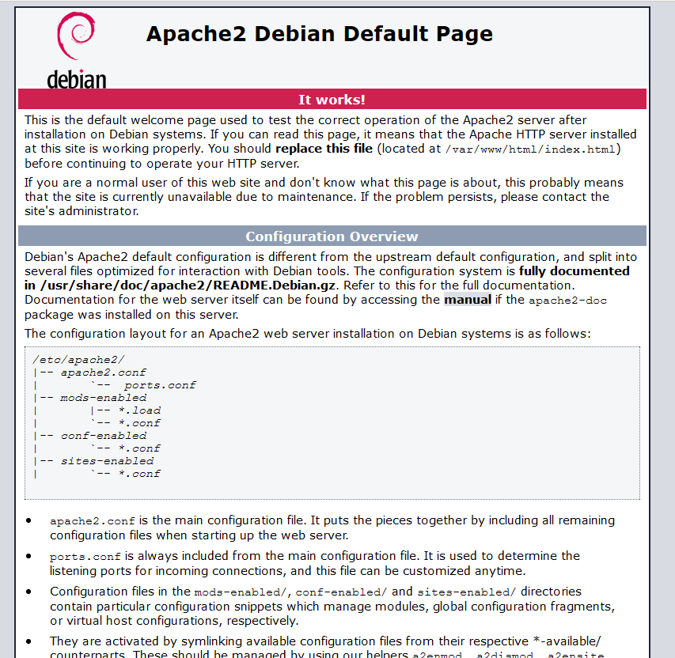
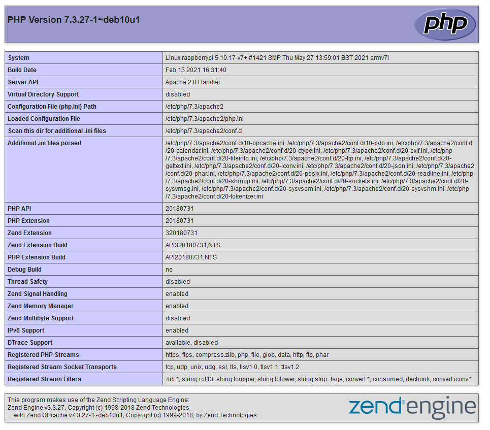
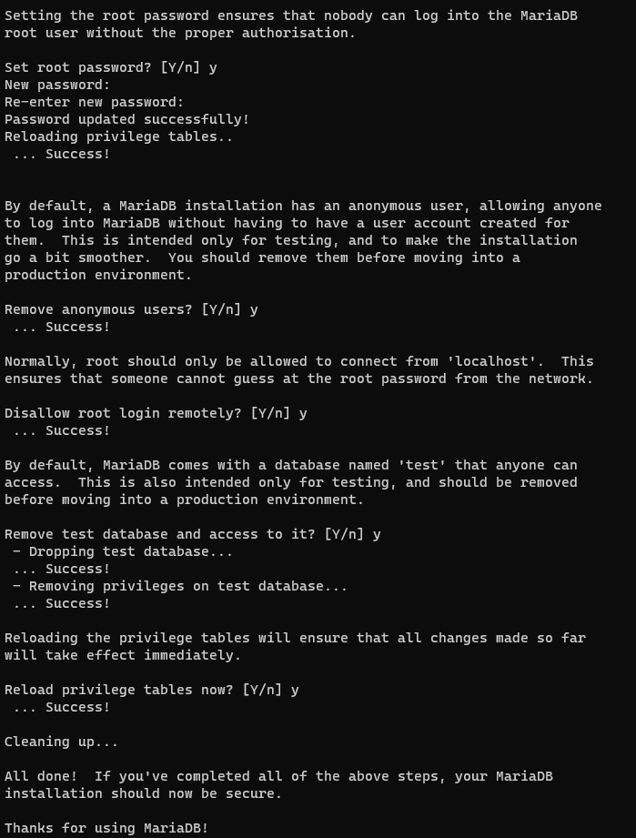

# Διακομιστής ιστοσελίδων

Για να έχουμε έναν πλήρως λειτουργικό διακομιστή δυναμικών ιστοσελίδων, θα πρέπει να εγκαταστήσουμε τουλάχιστον 3 λογισμικά. Τον διακομιστή στατικών ιστοσελίδων **Apache**, την **PHP** για την παραγωγή δυναμικών ιστοσελίδων και μια βάση δεδομένων **MariaDB**.

## Εγκατάσταση Apache

Η εγκατάσταση του Apache Web Server, γίνεται πολύ απλά με την παρακάτω εντολή:

`sudo apt install apache2 -y`

Από αυτήν την στιγμή. ο Apache είναι ενεργός. Για να ελέγξουμε την λειτουργία του, θα πρέπει να αρχικά να μάθουμε της διεύθυνση ΙΡ που έχει το Raspberry Pi. Για αυτό τον λόγο γράφουμε την εντολή:

`sudo ifconfig`

<p align="center">
    
</p>

Αφού γνωρίζουμε τη διεύθυνση ΙΡ, αν ανοίξουμε έναν φυλλομετρητή και γράψουμε την συγκεκριμένη διεύθυνση, θα μας δείξει την δοκιμαστική ιστοσελίδα του Apache. Στην περίπτωσή μας όμως, θα πρέπει να κάνουμε ακόμα ένα βήμα. Να ανοίξουμε την πόρτα 80 στο τοίχος προστασίας γράφοντας:

`sudo ufw allow 80`

και πλέον είμαστε έτοιμοι να ελέγξουμε την λειτουργία του διακομιστή ιστοσελίδων.

<p align="center">
    
</p>

Ο προεπιλεγμένος φάκελος στον οποίο αποθηκεύονται οι ιστοσελίδες είναι στο μονοπάτι **/var/www/html**.

## Εγκατάσταση PHP

Η PHP μας δίνει τη δυνατότητα να δημιουργούμε δυναμικές ιστοσελίδες και η εγκατάσταση της, ως πρόσθετο στον Apache, γίνεται με την παρακάτω εντολή:

`sudo apt install php libapache2-mod-php -y`

Για να ελέγξουμε την καλή λειτουργία της εγκατάστασης της PHP, θα πρέπει να δημιουργήσουμε μια ιστοσελίδα η οποία θα περιέχει εντολές της PHP. Αρχικά, θα πρέπει να αλλάξουμε τρέχοντα φάκελο με την εντολή `cd /var/www/html` και στη συνέχεια να δημιουργήσουμε μια απλή ιστοσελίδα. Γράφουμε `sudo nano test.php` και στον κειμενογράφο επικολλούμε την εντολή `<?php phpinfo(); ?>`. 

Αποθηκεύουμε πατώντας **Ctrl+O** και βγαίνουμε από το nano πατώντας **Ctrl+X**.

Ανοίγουμε έναν φυλλομετρητή και γράφουμε τη διεύθυνση του **http://<Διεύθυνση του Raspberry Pi>/test.php**

<p align="center">
    
</p>

**Σημείωση:** Για την σωστή λειτουργία πολλών συστημάτων διαχείρισης περιεχομένου (Wordpress, Joomla κτλ) θα πρέπει να εγκατασταθούν μερικά ακόμα πρόσθετα της PHP.

## Εγκατάσταση MariaDB

Η MariaDB είναι ένα λογισμικό διαχείρισης βάσεων δεδομένων, στον οποίο μπορούμε να αποθηκεύσουμε δεδομένα οποιασδήποτε μορφής. Χρησιμοποιείται ευρέως και έχει προέλθει από την MySQL. Για την εγκατάσταση του, χρησιμοποιούμε την παρακάτω εντολή:

`sudo apt install mariadb-server -y`

Για την ολοκλήρωση της εγκατάστασης θα πρέπει να εκτελέσουμε την παρακάτω εντολή:

`sudo mysql_secure_installation`

Στην πρώτη ερώτηση πατάμε Enter, αφού ακόμα δεν έχουμε ορίσει κωδικό πρόσβασης για τον διαχειριστή του συστήματος διαχείρισης βάσεων δεδομένων. Στη συνέχεια πατάμε **Y** για να ορίσουμε τον κωδικό πρόσβασης του διαχειριστή. Έπειτα, πατάμε διαδοχικά 3 φορές το **Υ** για την διαγραφή των ανώνυμων χρηστών, της απαγόρευσης απομακρυσμένης πρόσβασης του διαχειριστή και την διαγραφή της δοκιμαστικής βάσης δεδομένων. Τέλος, πατάμε ξανά **Υ** για την επαναφόρτωση των δικαιωμάτων του συστήματος διαχείρισης βάσεων δεδομένων.

<p align="center">
    
</p>

Στη συνέχεια, θα πρέπει να δημιουργήσουμε έναν χρήστη για να μπορούμε να διαχειριζόμαστε την βάση δεδομένων:

`sudo mysql -uroot -p`

Εισάγουμε τον κωδικό του διαχειριστή και στη συνέχεια γράφουμε:

`CREATE USER USER@localhost IDENTIFIED BY 'PASSWORD';`

Όπου **USER** εισάγουμε το όνομα χρήστη που θέλουμε να δημιουργήσουμε και **PASSWORD** τον κωδικό πρόσβασης που θέλουμε να έχει ο χρήστης.

```mysql
grant all privileges on *.* to admin@localhost;
FLUSH PRIVILEGES;
exit;
```