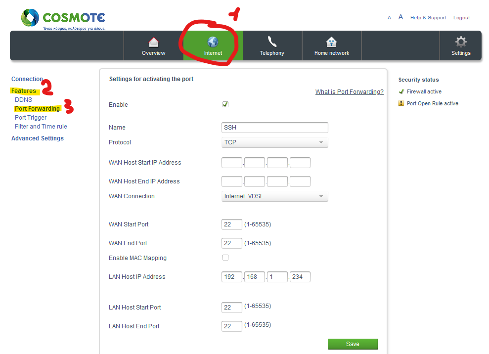

# Dynamic DNS και Port Forwarding

Επειδή θέλουμε να έχουμε πρόσβαση στο Raspberry Pi, χρησιμοποιώντας ένα domain name, από οπουδήποτε και όχι μόνο από το εσωτερικό δίκτυο του σχολείου, θα πρέπει πρώτα να ρυθμίσουμε μια υπηρεσία Dynamic DNS και στη συνέχεια να προωθήσουμε τις κατάλληλες πόρτες (port forwarding).

## Dynamic DNS

Στο σχολικό εργαστήριο, διαθέτουμε δυναμική διεύθυνση ΙΡ (εκτός από τα σχολεία που έχουν συνδεθεί στο διαδίκτυο με οπτική ίνα) και για αυτό τον λόγο θα χρησιμοποιήσουμε την Dynamic DNS η οποία είναι μια υπηρεσία η οποία συνδέει ένα domain name με μια δυναμική διεύθυνση ΙΡ. Για τις ανάγκες του οδηγού θα χρησιμοποιήσουμε την , η οποία είναι μια από τις πολλές υπηρεσίες δωρεάν DDNS.

1. Αρχικά θα πρέπει να δημιουργήσουμε έναν λογαριασμό στο DuckDNS και στη συνέχεια να δεσμεύσουμε ένα domain name.

<p align="center">
    
</p>

2. Αφού συνδεθούμε στο Raspberry Pi μέσω SSH, θα δημιουργήσουμε έναν φάκελο και μέσα σε αυτόν ένα αρχείο γράφοντας τις παρακάτω εντολές:

```console
mkdir duckdns
cd duckdns
nano duckdns.sh
```

Τώρα, θα επικολλήσουμε την παρακάτω εντολή μέσα στο αρχείο duckdns.sh:

```console
echo url="https://www.duckdns.org/update?domains=[YOUR_DOMAIN]&token=[YOUR_TOKEN]&ip=" | curl -k -o ~/duckdns/duck.log -K -
```

Στην θέση **YOUR_DOMAIN** εισάγουμε το domain name που δεσμεύσαμε και στην θέση **YOUR_TOKEN** εισάγουμε το token από την σελίδα του DuckDNS.

Αποθηκεύουμε πατώντας **Ctrl+O** και βγαίνουμε από το nano πατώντας **Ctrl+X**.

3. Θα αλλάξουμε τα δικαιώματα χρήσης του αρχείου, έτσι ώστε μόνο εμείς να έχουμε τη δυνατότητα να δούμε τα περιεχόμενά του και να το εκτελέσουμε. Γράφουμε την παρακάτω εντολή:

```console
chmod 700 duckdns.sh
```

4. Τέλος, θα πρέπει να εκτελούμε το αρχείο **duckdns.sh** σε τακτά χρονικά διαστήματα, χρησιμοποιώντας το **crontab**. Γράφουμε

```console
crontab -e
```

και στη συνέχεια κάνουμε επικόλληση το

```console
*/5 * * * * ~/duckdns/duckdns.sh >/dev/null 2>&1
```

Αποθηκεύουμε πατώντας **Ctrl+O** και βγαίνουμε από πατώντας **Ctrl+X**.

<p align="center">
    
</p>

Έτσι, θα εκτελείται κάθε 5 λεπτά η εντολή που έχουμε εισάγει μέσα στο αρχείο duckdns.sh και θα ενημερώνεται το domain name με την δυναμική IP που θα έχει ο δρομολογητής μας.

## Port Forward

Μέχρι τώρα, έχουμε δώσει στατική διεύθυνση ΙΡ και έχουμε κάνει τις απαραίτητες ενέργειες έτσι ώστε να έχει ένα domain name το Raspberry Pi. Αυτό που μένει για να έχουμε πρόσβαση στο Raspberry Pi από το διαδίκτυο είναι να κάνουμε προώθηση τις απαραίτητες πόρτες. Η διαδικασία γίνεται μέσω της σελίδας διαχείρισης του δρομολογητή - modem.

1. Συνδέομαστε στο διαχειριστικό περιβάλλον του δρομολογητή - modem

2. Πατάμε αρχικά του κουμπάκι **Internet** (βρίσκεται στην κορυφή της σελίδας), στη συνέχεια πατάμε τον σύνδεσμο **Features** (βρίσκεται στο αριστερό τμήμα της σελίδας) και τέλος πατάμε τον σύνδεσμο **Port forwarding**. Στην παρακάτω εικόνα βλέπουμε το περιεχόμενο των πεδίων έτσι ώστε να προωθήσουμε την πόρτα 22, η οποία χρησιμοποιείται από το SSH. Πατώντας **Save**, ο δρομολογητής θα προωθεί την κίνηση δεδομένων που αφορά την πόρτα 22 στο Raspberry Pi. Με τον ίδιο τρόπο μπορούμε να κάνουμε προώθηση όσες πόρτες επιθυμούμε (). Η πόρτα που πρέπει να προωθήσουμε για τον διακομιστή ιστοσελίδων είναι η 80. Αφού προωθήσουμε την πόρτα 80, θα έχουμε τη δυνατότητα να δούμε τις ιστοσελίδες που έχουμε αποθηκεύσει στο Raspberry Pi, από οπουδήποτε στο διαδίκτυο χρησιμοποιώντας το domain name που δεσμεύσαμε.

<p align="center">
    
</p>


**Σημείωση**: Το διαχειριστικό περιβάλλον κάθε ενός δρομολογητή είναι διαφορετικό