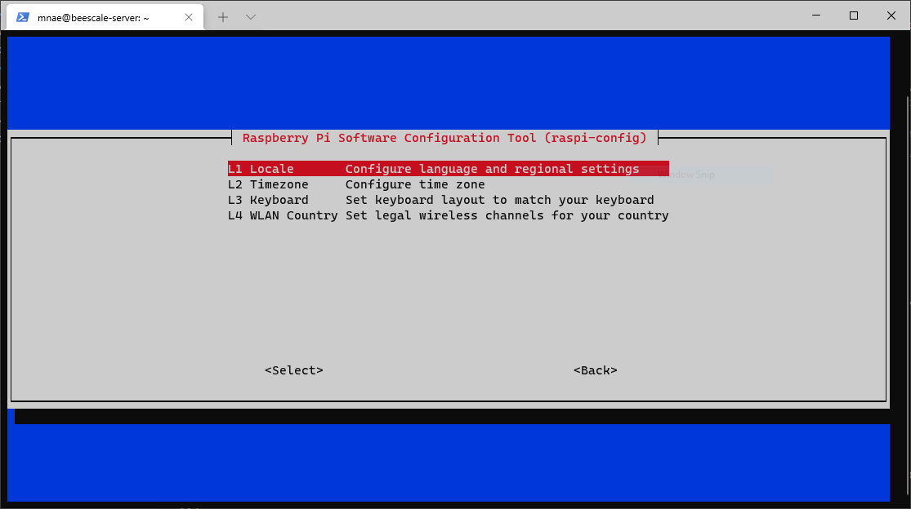
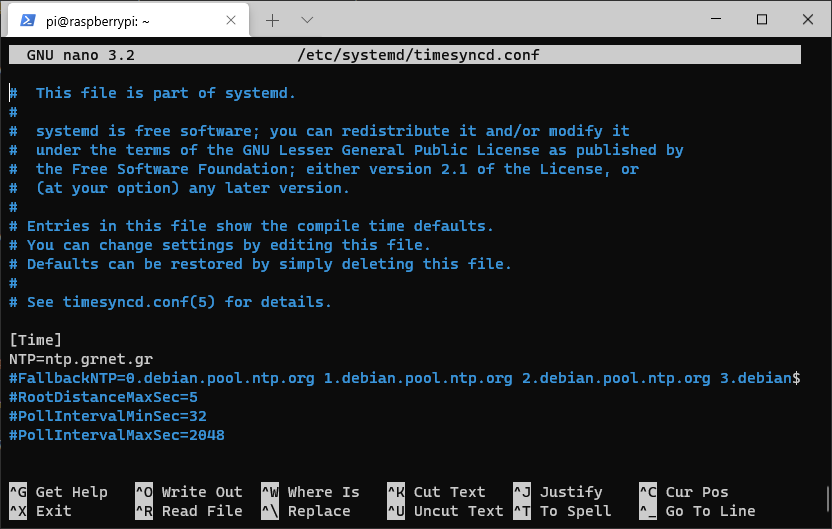
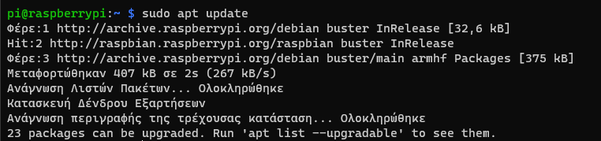

# Πρώτη εκκίνηση

Παρακάτω θα δούμε μερικές βασικές ενέργειες που κάνουμε μετά την πρώτη εκκίνηση, με σκοπό να αναβαθμίσουμε τα πακέτα λογισμικού και να αυξήσουμε την ασφάλεια του Raspberry Pi.

## Αλλαγή του κωδικού πρόσβασης για τον χρήστη pi

Επειδή ο κωδικός πρόσβασης σε όλες τις αρχικές εγκαταστάσεις του Raspberry Pi είναι ίδιος, θα πρέπει να τον αλλάξουμε. Για να αλλάξουμε τον κωδικό του χρήστη pi, θα χρησιμοποιήσουμε το εργαλείο **raspi-config**. Επειδή το συγκεκριμένο εργαλείο (όπως και όλες τις εντολές που αφορούν στην διαχείριση του συστήματος) μπορεί να το εκτελέσει μόνο ο διαχειριστής (root), θα πρέπει να εισάγουμε την εντολή **sudo** πριν από την κλήση του εργαλείου raspi-config.
***Η εντολή **sudo** χρησιμοποιείται στην περίπτωση που, σαν απλοί χρήστες, θέλουμε να εκτελέσουμε μια εντολή με δικαιώματα διαχειριστή.***
Περισσότερες πληροφορίες για την εντολή **sudo** (https://el.wikipedia.org/wiki/Sudo - https://www.raspberrypi.org/documentation/linux/usage/root.md)

`sudo raspi-config`

Αφού εισάγουμε τον κωδικό πρόσβασης, θα ανοίξει το εργαλείο ρυθμίσεων με την παρακάτω εικόνα.

    

Επιλέγουμε διαδοχικά **System Options** και **Password**. Εισάγουμε τον κωδικό πρόσβασης δύο φορές (η δεύτερη για επιβεβαίωση). **Σημείωση:** Κατά την πληκρολόγηση του κωδικού πρόσβασης δεν εμφανίζεται κανένας χαρακτήρας.

Η αλλαγή του κωδικού πρόσβασης μπορεί να γίνει πιο εύκολα εισάγοντας την παρακάτω εντολή:

`sudo passwd`

## Δημιουργία χρήστη

## Τοπικές ρυθμίσεις

Μέσω του εργαλείου **raspi-config** θα ρυθμίσουμε το Raspberry Pi έτσι ώστε να αναγνωρίζει τους ελληνικούς χαρακτήρες. Επίσης, θα ρυθμίσουμε την ζώνη ώρας.

    

1. Για την ορισμό της κωδικοποίησης των χαρακτήρων, γράφουμε στην κονσόλα `sudo raspi-config` επιλέγοντας αρχικά **Localisation Options** και στη συνέχεια **Locale**. Από την λίστα, επιλέγουμε το **el_GR.UTF-8 UTF-8** και το **en_US.UTF-8 UTF-8** και αποεπιλέγουμε το **en_GB.UTF-8 UTF-8**. Στο επόμενο βήμα, επιλέγουμε το **el_GR.UTF-8 UTF-8** έτσι ώστε να ορίσουμε τα ελληνικά σαν προεπιλογή στο λειτουργικό σύστημα. Μετά το τέλος της διαδικασίας, επιστρέφουμε στην αρχική οθόνη του raspi-config.

2. Για την αλλαγή της ζώνης ώρας, αφού έχουμε ανοιχτό το εργαλείο raspi-config, επιλέγουμε **Localisation Options** και στη συνέχεια **Timezone**. Στη συνέχεια επιλέγουμε διαδοχικά **Europe** και **Athens**.

## Ενεργοποίηση του συγχρονισμού ώρας

Για την ενεργοποίηση του συγχρονισμού της ώρας του συστήματός μας, θα αλλάξουμε τον διακομιστή συγχρονισμού, στο αρχείο **/etc/systemd/timesyncd.conf**. Γράφουμε την παρακάτω εντολή:

`sudo nano /etc/systemd/timesyncd.conf`

**Σημείωση**. Η εντολή **sudo** χρειάζεται, γιατί οι αλλαγές που θα κάνουμε αφορούν αρχείο του συστήματος και για αυτήν την εργασία απαιτούνται δικαιώματα διαχειριστή. Η δεύτερη εντολή **nano** είναι ένας επεξεργαστής κειμένου. Τροποποιούμε το αρχείο σύμφωνα με την παρακάτω εικόνα. Αποθηκεύουμε και κλείνουμε τον nano πατώντας **Ctrl+K** και στη συνέχεια **X**.

    

Για να εφαρμοστούν οι αλλαγές, θα πρέπει να επανεκκινήσουμε την υπηρεσία συγχρονισμού ώρας, γράφοντας την παρακάτω εντολή:

`sudo systemctl restart systemd-timesyncd.service`

## Ενημέρωση του λειτουργικού συστήματος

Για την αναβάθμιση του συστήματος, θα χρησιμοποιήσουμε την εντολή **apt**. Πιο συγκεκριμένα, πρώτα θα πρέπει να ενημερώσουμε την λίστα των πακέτων λογισμικού γράφοντας:

`sudo apt update`

    

Μετά την ενημέρωση της λίστας των πακέτων, αν υπάρχουν αναβαθμίσεις, μπορούμε να προχωρήσουμε σε αναβάθμιση με την εντολή:

`sudo apt upgrade -y`

    

**Σημείωση**. Με την παράμετρο **-y** δηλώνουμε προκαταβολικά ότι αποδεχόμαστε τις αλλαγές που θα κάνει η εκτέλεση της εντολής **apt upgrade**.

## Εγκατάσταση και ενεργοποίηση τοίχους προστασίας

Από την στιγμή που το Raspberry Pi θα είναι προσβάσιμο από όλους στο διαδίκτυο, θα πρέπει να εγκαταστήσουμε ένα τοίχος προστασίας έτσι ώστε να μειώσουμε τον κίνδυνο κάποιας εισβολής. Για αυτόν τον λόγο θα εγκαταστήσουμε ένα τοίχος προστασίας, το οποίο θα επιτρέπει την πρόσβαση μόνο σε συγκεκριμένες υπηρεσίες. Γράφουμε την παρακάτω εντολή:

`sudo apt install ufw`

Για να επιτρέψουμε τη σύνδεση μέσω SSH, θα πρέπει να ανοίξουμε την πόρτα 22 στο τοίχος προταστασίας.

`sudo ufw allow 22`

Τέλος, θα πρέπει να ενεργοποιήσουμε το τοίχος προστασίας.

`sudo ufw enable`

Πλέον, επιτρέπουμε να γίνονται συνδέσεις προς την πόρτα 22 του Raspberry Pi από οποιαδήποτε διεύθυνση.