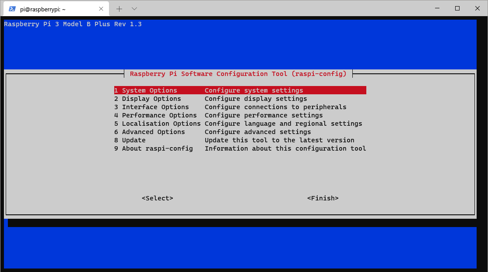

# Πρώτη εκκίνηση

Παρακάτω θα δούμε μερικές βασικές ενέργειες που κάνουμε μετά την πρώτη εκκίνηση, με σκοπό να αναβαθμίσουμε τα πακέτα λογισμικού και να αυξήσουμε την ασφάλεια του Raspberry Pi.

## Αλλαγή του κωδικού πρόσβασης για τον χρήστη pi

Επειδή ο κωδικός πρόσβασης σε όλες τις αρχικές εγκαταστάσεις του Raspberry Pi είναι ίδιος, θα πρέπει να τον αλλάξουμε. Για να αλλάξουμε τον κωδικό του χρήστη pi, θα χρησιμοποιήσουμε το εργαλείο **raspi-config**. Επειδή το συγκεκριμένο εργαλείο (όπως και όλες τις εντολές που αφορούν στην διαχείριση του συστήματος) μπορεί να το εκτελέσει μόνο ο διαχειριστής (root), θα πρέπει να εισάγουμε την εντολή **sudo** πριν από την κλήση του εργαλείου raspi-config.
***Η εντολή **sudo** χρησιμοποιείται στην περίπτωση που, σαν απλοί χρήστες, θέλουμε να εκτελέσουμε μια εντολή με δικαιώματα διαχειριστή.***
Περισσότερες πληροφορίες για την εντολή **sudo** (https://el.wikipedia.org/wiki/Sudo - https://www.raspberrypi.org/documentation/linux/usage/root.md)

`sudo raspi-config`

    

##
