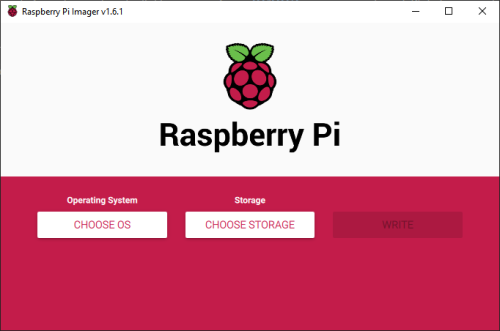
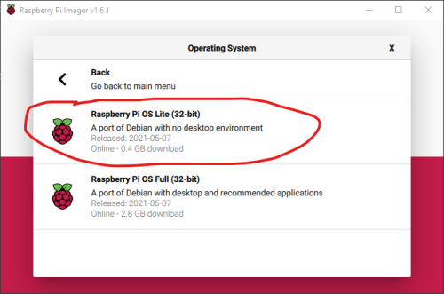
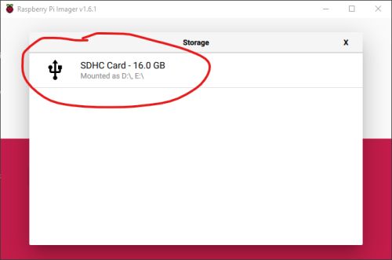
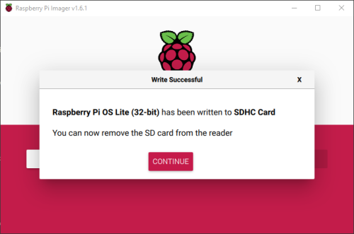
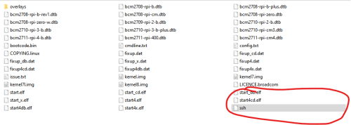
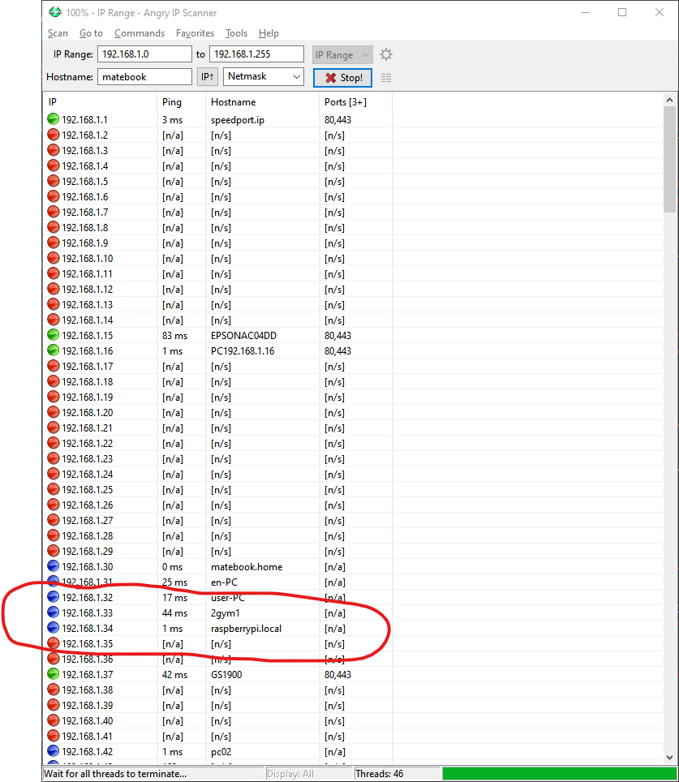
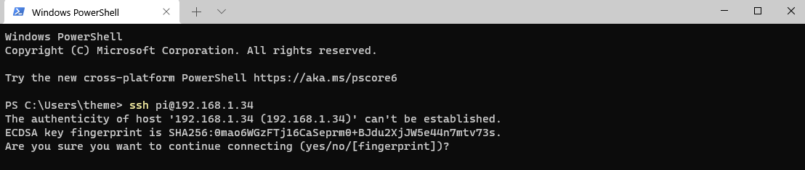
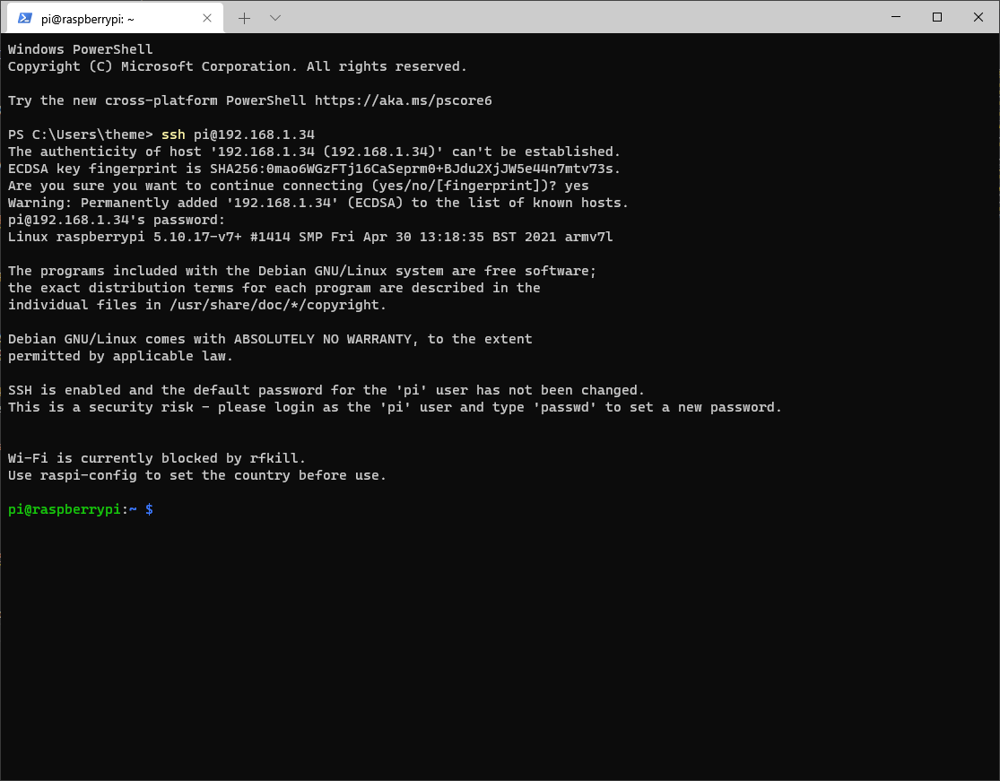

# Εγκατάσταση του Raspberry Pi OS Lite

Το Raspberry Pi OS Lite είναι μια "ελαφριά" έκδοση του Raspberry Pi OS και η βασική τους διαφορά είναι ότι από το Lite έχει αφαιρεθεί το γραφικό περιβάλλον διεπαφής (GUI). Στο Lite, η επικοινωνία μας με το Raspberry Pi θα γίνεται σε περιβάλλον εντολών (CLI - https://en.wikipedia.org/wiki/Command-line_interface) μετά από σύνδεση με SSH (https://en.wikipedia.org/wiki/Secure_Shell_Protocol).
Το Raspberry Pi OS Lite καταναλώνει πολύ λίγους πόρους από το σύστημα και έτσι είναι χρήσιμο στην περίπτωση που θέλουμε να χρησιμοποιήσουμε το Raspberry Pi σαν διακομιστή. 

## Raspberry Pi Imager

    

Ο πιο εύκολος τρόπος για να εγκαταστήσουμε, σε μια κάρτα μνήμης micro SD, το Raspberry Lite είναι με τη χρήση του Raspberry Pi Imager - (https://www.raspberrypi.org/software/), ακολουθώντας την παρακάτω διαδικασία.

* Αφου κατεβάσουμε, εγκαταστήσουμε και τρέξουμε το Raspberry Pi Imager, θα πατήσουμε το κουμπί **CHOOSE OS** και θα επιλέξουμε διαδοχικά **Raspberry Pi OS (other)** και **Raspberry Pi OS Lite (32-bit)**

    

* Πατώντας το κουμπί **CHOOSE STORAGE** θα επιλέξουμε την κάρτα μνήμης που έχουμε τοποθετήσει στον υπολογιστή μας.

    

* Τέλος, πατάμε το κουμπί **WRITE** και θα ξεκινήσει η διαδικασία εγγραφής του λειτουργικού συστήματος στην κάρτα μνήμης. Μετά από περίπου 10 λεπτά θα έχει ολοκληρωθεί η εγκατάσταση του Raspberry Pi OS Lite στην κάρτα μνήμης.

    

## Ενεργοποίηση SSH

* Μετά την ολοκλήρωση της εγγραφής του λειτουργικού συστήματος στην κάρτα μνήμης, η πρώτη μας κίνηση είναι να δημιουργήσουμε ένα κενό αρχείο με όνομα **ssh** στο διαμέρισμα **boot** της κάρτας μνήμης. Με αυτόν τον τρόπο ενεργοποιούμε την δυνατότητα σύνδεσης στο Raspberry Pi μέσω του πρωτοκόλλου SSH και έτσι δεν υπάρχει η ανάγκη να συνδέσουμε τον Raspberry Pi σε κάποια οθόνη.

    

* Αφαιρούμε, με ασφάλεια, την κάρτα μνήμης από τον υπολογιστή και την εισάγουμε στο Raspberry Pi. Συνδέουμε και ένα καλώδιο δικτύου και στη συνέχεια τροφοδοτούμε το Raspberry Pi με ρεύμα.

## Σύνδεση στο Raspberry Pi μέσω SSH

Για να συνδεθούμε στο Raspberry Pi μέσω SSH, θα πρέπει πρώτα να μάθουμε τη διεύθυνση ΙΡ που έχει πάρει το Raspberry από τον δρομολογητή μας ή να δοκιμάσουμε να συνδεθούμε χρησιμοποιώντας το hostname του Raspberry Pi.

* Το αρχικό **hostname** του Raspberry Pi είναι **raspberrypi.local** και μπορούμε να συνδεθούμε χρησιμοποιώντας αυτό το όνομα. Πολλές φορές όμως, ειδικά αν ο υπολογιστής που χρησιμοποιούμε για τη σύνδεση έχει Windows, αυτός ο τρόπος δεν λειτουργεί.

* Αν δεν λειτουργήσει η σύνδεση με το hostname, θα πρέπει να χρησιμοποιήσουμε ένα IP Scanner, όπως το Angry IP (https://angryip.org/download/). Αφού το κατεβάσουμε, το εγκαταστήσουμε και το εκτελέσουμε θα πρέπει να πατήσουμε το κουμπί **Start** για να δούμε την λίστα με τις συσκευές που είναι συνδεδεμένες στο δίκτυο μας.

    

Στην πιο πάνω εικόνα φαίνεται ότι το Raspberry Pi έχει πάρει την διεύθυνση ΙΡ **192.168.1.34** και έχει **Hostname** το **raspberrypi.local**.

* Από τη στιγμή που γνωρίζουμε την διεύθυνση IP του Raspberry Pi μπορούμε να χρησιμοποιήσουμε έναν οποιονδήποτε πελάτη SSH για να συνδεθούμε. Αν και στα Windows, ο πιο γνωστός πελάτης SSH είναι το Putty (https://www.chiark.greenend.org.uk/~sgtatham/putty/latest.html), εμείς σε αυτόν τον οδηγό θα χρησιμοποιήσουμε την τελευταία έκδοση του Windows Terminal (https://www.microsoft.com/store/productId/9N0DX20HK701) το οποίο υποστηρίζει συνδέσεις μέσω SSH.

Ανοίγουμε λοιπόν το Windows Terminal και γράφουμε την εντολή με την οποία θα συνδεθούμε στο Raspberry Pi. Μετά την εντολή ssh ακολουθεί το όνομα χρήστη με το οποίο θέλουμε να συνδεθούμε και η διεύθυνση IP του Raspberry. Το αρχικό όνομα χρήστη είναι **pi** και ο κωδικός πρόσβασης είναι **raspberry**.

`ssh pi@192.168.1.34` ή `ssh pi@raspberrypi.local`

Πατώντας Enter θα πραγματοποιηθεί σύνδεση με το Raspberry Pi και, την πρώτη φόρμα, θα εμφανιστεί το παρακάτω μήνυμα, στο οποίο θα πρέπει να γράψουμε **yes** έτσι ώστε να αποθηκευτεί το κλειδί SSH.

    

Στη συνέχεια θα γράψουμε τον κωδικό πρόσβασης και πλέον θα έχουμε συνδεθεί στο Raspberry Pi μέσω του πρωτοκόλλου SSH.

    

