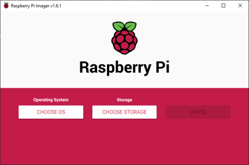

# Εγκατάσταση του Raspberry Pi OS Lite

Το Raspberry Pi OS Lite είναι μια "ελαφριά" έκδοση του Raspberry Pi OS και σε σύγκριση με το Raspberry Pi OS δεν έχει γραφικό περιβάλλον διεπαφής, επίσης έχουν αφαιρεθεί και κάποια ακόμα λογισμικά. Η συγκεκριμένη έκδοση καταναλώνει πολύ λίγους πόρους από το σύστημα και έτσι είναι χρήσιμη στην περίπτωση που θέλουμε να χρησιμοποιήσουμε το Raspberry Pi σαν διακομιστή. Η επικοινωνία μας το Raspberry Pi θα γίνεται σε περιβάλλον εντολών (CLI - https://en.wikipedia.org/wiki/Command-line_interface) μετά από σύνδεση με SSH (https://en.wikipedia.org/wiki/Secure_Shell_Protocol).

## Raspberry Pi Imager

Ο πιο εύκολος τρόπος για να εγκαταστήσουμε, σε μια κάρτα μνήμης micro SD, το Raspberry Lite είναι με τη χρήση του Raspberry Pi Imager - (https://www.raspberrypi.org/software/), ακολουθώντας την παρακάτω διαδικασία.

* Αφου κατεβάσουμε, εγκαταστήσουμε και τρέξουμε το Raspberry Pi Imager, θα επιλέξουμε **Raspberry Pi OS (other)** και στη συνέχεια **Raspberry Pi OS Lite (32-bit)**

## Αρχικές ρυθμίσεις

## 